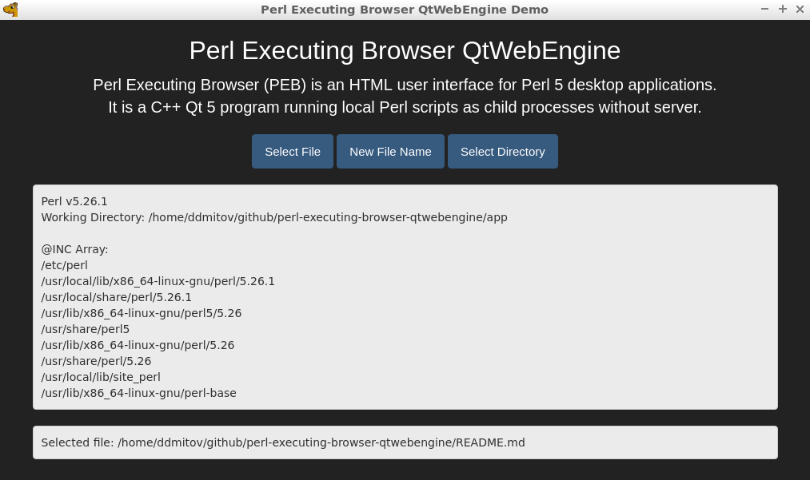

# Perl Executing Browser QtWebEngine

Perl Executing Browser QtWebEngine is a Linux version of the [Perl Executing Browser](https://github.com/ddmitov/perl-executing-browser) using [QtWebEngine](https://wiki.qt.io/QtWebEngine).

Perl Executing Browser (PEB) is an HTML user interface for [Perl 5](https://www.perl.org/) desktop applications.  
It is a C++ [Qt 5](https://www.qt.io/) application running local Perl scripts as child processes without server.  

  

## Contents

* [Design Objectives](#design-objectives)
* [Features](#features)
* [Security](#security)
* [Limitations](#limitations)
* REQUIREMENTS
  * [Compile-Time Requirements](./doc/REQUIREMENTS.md#compile-time-requirements)
  * [Runtime Requirements](./doc/REQUIREMENTS.md#runtime-requirements)
* FILES AND FOLDERS
  * [Application Executable](./doc/FILES.md#application-executable)
  * [Application Files and Folders](./doc/FILES.md#application-files-and-folders)
* SETTINGS
  * [Global Settings API](./doc/SETTINGS.md#global-settings-api)
  * [Perl Scripts API](./doc/SETTINGS.md#perl-scripts-api)
  * [Files and Folders Dialogs API](./doc/SETTINGS.md#files-and-folders-dialogs-api)
* [History](#history)
* [Thanks and Credits](./CREDITS.md)
* [License](./LICENSE.md)
* [Authors](#authors)

The key words "MUST", "MUST NOT", "REQUIRED", "SHALL", "SHALL NOT",  
"SHOULD", "SHOULD NOT", "RECOMMENDED", "MAY" and "OPTIONAL"  
in the documentation of this project are to be interpreted as described in [RFC 2119](https://www.ietf.org/rfc/rfc2119.txt).  

## Design Objectives

* **1. Easy graphical user interface for Perl 5 desktop applications**  
* **2. Secure solution with no server process**  
* **3. Maximal reuse of existing web technologies and standards**

## Features

* No limitation on how long a Perl script can run.
* [Output from Perl scripts is seamlessly inserted in a web-like user interface.](./doc/SETTINGS.md#perl-scripts-api)
* Any version of Perl 5 can be used.
* [Local full paths can be selected and passed to Perl scripts.](./doc/SETTINGS.md#selecting-files-and-folders)  
* [Optional warning for unsaved data in HTML forms](./doc/SETTINGS.md#html-page-api)
* [Optional labels for the JavaScript popup boxes](./doc/SETTINGS.md#html-page-api)
* [Optional labels for the context menus](./doc/SETTINGS.md#html-page-api)
* [Optional icon](./doc/FILES.md)

## Security

* PEB does not need and does not implement a server process.
* PEB Perl scripts can not be called from web pages.
* PEB Perl scripts are executed locally with no sandbox.

## Limitations

* No Perl scripting inside frames
* No pop-up windows
* No printing
* No AppImage support

## History

PEB was started in 2013 as a simple user interface for personal database applications.  
PEB QtWebEngine became a separate application in 2018.

## [Thanks and Credits](./CREDITS.md)

## [License](./LICENSE.md)

This program is free software;  
you can redistribute it and/or modify it under the terms of the GNU Lesser General Public License,  
as published by the Free Software Foundation;  
either version 3 of the License, or (at your option) any later version.  
This program is distributed in the hope that it will be useful, but WITHOUT ANY WARRANTY;  
without even the implied warranty of MERCHANTABILITY or FITNESS FOR A PARTICULAR PURPOSE.

## Author

Dimitar D. Mitov, 2018 - 2019, 2023
